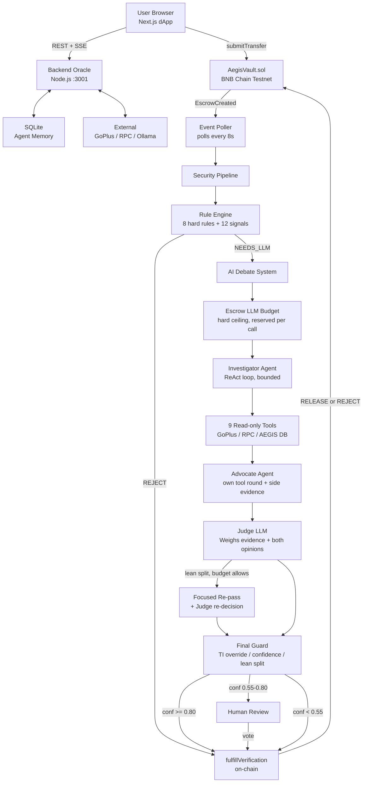
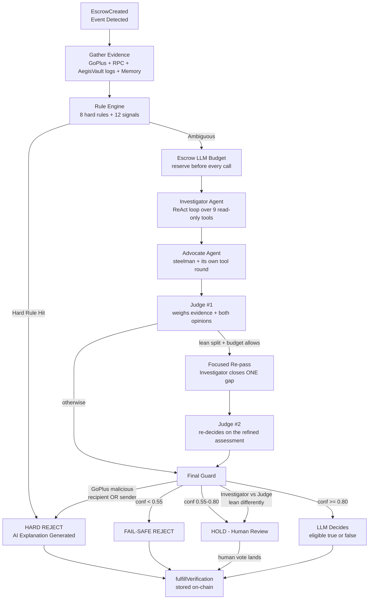
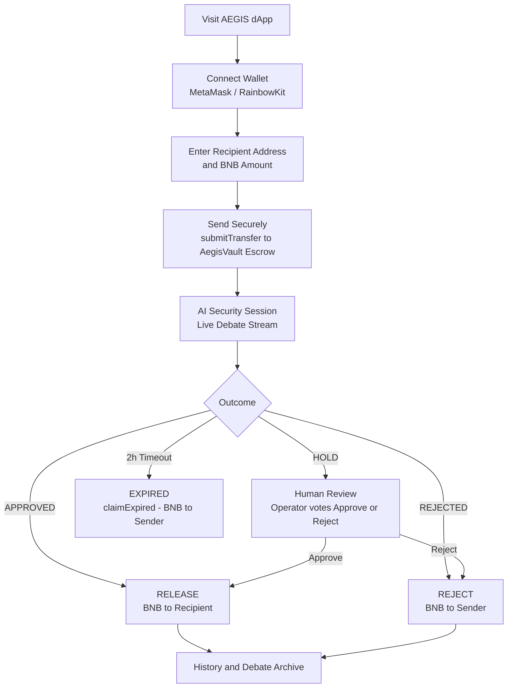

<div align="center">

# AEGIS - Escrow Guardian & Threat-Intelligence Oracle
### AI-Powered Smart Escrow & Security Guardian for Web3

**Multi-Agent Escrow Security Oracle for On-Chain Transfers on BNB Chain**

[](https://testnet.bscscan.com/)
[](https://soliditylang.org/)
[](https://nextjs.org/)
[](https://www.typescriptlang.org/)
[](https://ollama.com/)
[](#license)

> **AEGIS** is an AI escrow oracle that guards crypto transfers before they hit the blockchain.
> Funds are locked in a smart escrow vault, analyzed by a multi-layer AI security pipeline,
> and only released when the transaction passes - protecting users from scams, phishing, and fraud in real time.
> What each layer can actually observe is documented in
> [Evidence Honesty](#evidence-honesty---what-the-oracle-can-and-cannot-see); read it before trusting a green light.

[Architecture](#system-architecture) | [Evidence Honesty](#evidence-honesty---what-the-oracle-can-and-cannot-see) | [Quick Start](#quick-start) | [AI Agent Flow](#ai-agent-flow) | [Roadmap](#roadmap--business-model)

</div>

---

## Table of Contents

- [Overview](#overview)
- [Key Features](#key-features)
- [System Architecture](#system-architecture)
- [Project Structure](#project-structure)
- [Tech Stack](#tech-stack)
- [Smart Contract](#smart-contract)
- [Evidence Honesty - What the Oracle Can and Cannot See](#evidence-honesty---what-the-oracle-can-and-cannot-see)
- [AI Agent Flow](#ai-agent-flow)
- [User Flow](#user-flow)
- [Security Pipeline Rules](#security-pipeline-rules)
- [Quick Start](#quick-start)
- [API Reference](#api-reference)
- [Roadmap & Business Model](#roadmap--business-model)
- [Business Model](#business-model)
- [Running Tests](#running-tests)
- [Repository](#repository)
- [Team](#team)
- [Security Disclosures](#security-disclosures)
- [License](#license)

---

## Overview

**AEGIS** (Escrow Guardian & Intelligence System) is a **Web3 security oracle** designed to prevent
fraudulent crypto transactions before they are irreversibly settled on the blockchain.

The core premise: **most crypto scams succeed because transactions are instant and irreversible.**
AEGIS interrupts this pattern by placing every transfer into a time-locked smart escrow and running it
through a multi-layer AI security pipeline before funds are released.

### The Problem

| Problem | Impact |
|---|---|
| Crypto scams and phishing drain billions annually | $14B+ lost in 2021, growing year-over-year |
| Transactions are irreversible once confirmed | No recourse for victims after the fact |
| Users lack tools to verify recipient safety in real time | Transfers sent to wrong or malicious addresses |
| Rule-based security systems miss novel attack patterns | Zero-day exploits bypass static filters |

### The AEGIS Solution

AEGIS intercepts every transfer at the escrow level, then deploys a **three-tier AI analysis pipeline**:

1. **Rule Engine** - Deterministic hard-coded security rules (instant REJECT for known-bad patterns)
2. **Three-Agent Debate** - Investigator (tool-calling) -> Advocate (steelman of the opposite case) -> Judge
3. **Human-in-the-Loop** - Edge cases escalate to a human operator before on-chain settlement

> **Scope note, stated plainly.** AEGIS runs a fixed pipeline, not an autonomous
> agent loop: gather evidence -> rules -> Investigator (bounded ReAct tool rounds) ->
> Advocate -> Judge -> guard. Inside that frame the LLM chooses *which* registered
> tool to call; it cannot plan past its budget, retry indefinitely, spawn
> sub-agents, or re-enter the loop on its own.

---

## Key Features

| Feature | Description |
|---|---|
| Smart Escrow Vault | Funds locked in AegisVault.sol - never accessible to the oracle owner |
| Three-Agent Debate | Investigator (tool-calling) -> Advocate (own tool round) -> Judge, structured JSON |
| Native Tool Calling | Ollama `/api/chat` ReAct loop; LLM picks from 9 read-only tools, bounded per agent and per escrow |
| Focused Re-pass | After the debate the Investigator closes its single biggest gap with tools, then the Judge rules again |
| Lessons from Humans | Human votes become advisory lessons for the next Investigator - ground truth only, never self-reinforcement |
| Agent Memory | SQLite-backed memory, **final decisions only** - both recipient and sender sides |
| GoPlus Integration | Multi-chain screening of **both** the recipient and the sender (chains 56 + 97) |
| On-Chain Intel (RPC) | Nonce, balance, EIP-7702-aware contract detection, and real AEGISVault escrow history from `eth_getLogs` |
| Evidence Honesty | Every number carries its source; `unavailable` is never read as zero or "safe" |
| Human-in-the-Loop | Uncertain cases sent to human operator who casts the final on-chain vote |
| Live SSE Stream | Real-time AI debate streamed to the frontend via Server-Sent Events |
| Escrow Timeout | Funds auto-return to sender after 2 hours if oracle is unresponsive |
| Emergency Withdraw | Sender reclaims funds immediately if contract is paused |
| Two-Step Oracle Rotation | 24h timelock before oracle key rotation - prevents silent SPOF takeovers |
| Red Team Suite | Automated adversarial testing suite (`redTeam.ts`, 50 cases) for pipeline hardening |

---

## System Architecture



---

## Project Structure

```
AEGIS/
|-- README.md
|-- .gitignore
|
|-- contracts/                        Solidity Smart Contracts (Foundry)
|   |-- src/
|   |   +-- AegisVault.sol            Main escrow + oracle contract
|   |-- test/
|   |   +-- AegisVault.t.sol          Foundry test suite (30 tests)
|   |-- script/
|   |   +-- Deploy.s.sol              Deployment script (Forge broadcast)
|   |-- lib/
|   |   |-- forge-std/                Foundry standard library (submodule)
|   |   +-- openzeppelin-contracts/   OpenZeppelin v5 (submodule)
|   |-- foundry.toml
|   |-- .gitmodules
|   +-- .env                          PRIVATE_KEY / ORACLE_ADDRESS / RPC_URL (git-ignored)
|
|-- backend/                          AI Oracle Backend (Node.js / TypeScript)
|   |-- index.ts                      Entry point - starts poller + HTTP server
|   |-- src/
|   |   |-- config.ts                 All env vars + viem public/wallet clients
|   |   |-- server.ts                 Express REST + SSE server (:3001)
|   |   |-- poller.ts                 On-chain event listener + fulfillment loop
|   |   |-- securityPipeline.ts       Main 9-step orchestration pipeline + final guard
|   |   |-- ruleEngine.ts             8 hard rules + 12 signals (pure, no I/O)
|   |   |-- denylist.ts               Local GoPlus-independent denylist (RULE_12)
|   |   |-- redTeam.ts                Adversarial red-team test runner (50 cases)
|   |   |-- aiAnalyzer.ts             Investigator / Advocate / re-pass / Judge
|   |   |-- agentLoop.ts              Bounded ReAct tool loop over Ollama /api/chat
|   |   |-- ollamaChat.ts             Native tool-calling transport + shared lock
|   |   |-- llmBudget.ts              Per-escrow hard ceiling on LLM calls
|   |   |-- tools.ts                  9 read-only tools + scope/execution boundary
|   |   |-- agentMemory.ts            SQLite-based per-address decision memory
|   |   |-- agentLessons.ts           Lessons distilled from human ground truth
|   |   |-- lessonWriter.ts           Optional post-decision lesson generation
|   |   |-- goplusChecker.ts          GoPlus Security API integration
|   |   |-- bscscanChecker.ts         On-chain intel: RPC + AegisVault event log
|   |   |-- db.ts                     SQLite schema + query helpers
|   |   |-- streamBus.ts              SSE event bus (publish/subscribe pattern)
|   |   |-- abi.ts                    AegisVault ABI for viem
|   |   |-- testSetup.ts              Global node:test bootstrap (DB isolation)
|   |   +-- *.test.ts                 12 node:test suites - 204 cases
|   |-- scripts/
|   |   +-- cleanTestRows.ts          One-off sweeper for legacy test-* rows in aegis.db
|   |-- data/
|   |   +-- denylist.json             Local denylist seed read by RULE_12
|   |-- aegis.db                      SQLite database (auto-created on first start)
|   |-- package.json
|   |-- tsconfig.json
|   +-- .env.example
|
+-- frontend/                         Next.js Frontend (React / TypeScript)
    |-- app/
    |   |-- layout.tsx                Root layout + RainbowKit/Wagmi providers
    |   |-- page.tsx                  Main single-page dashboard
    |   |-- favicon.ico
    |   +-- globals.css               Global styles + design tokens
    |-- components/
    |   |-- Hero.tsx                  Landing hero section (pre-connect state)
    |   |-- SendForm.tsx              Transfer form (wallet to escrow)
    |   |-- LiveDebate.tsx            Real-time AI debate viewer component
    |   |-- DebateStream.tsx          SSE stream context provider
    |   |-- DebateModal.tsx           Full-screen debate modal popup
    |   |-- DebateHistory.tsx         Past AI verification archive
    |   |-- EscrowHistory.tsx         Transaction history table
    |   |-- HumanReview.tsx           Human-in-the-loop review panel
    |   |-- HumanQueue.tsx            Pending human review queue provider
    |   |-- AddressFilter.tsx         Address filter input component
    |   +-- Providers.tsx             Wagmi + RainbowKit + TanStack Query providers
    |-- config/
    |   |-- contract.ts               Contract address + trimmed UI ABI
    |   +-- wagmi.ts                  Wagmi/RainbowKit chain configuration
    |-- lib/
    |   |-- api.ts                    Backend API client + typed error helpers
    |   +-- utils.ts                  Address validation and utilities
    |-- public/
    |   +-- hero_hands.jpg
    |-- next.config.ts
    |-- postcss.config.mjs
    |-- eslint.config.mjs
    |-- package.json
    |-- tsconfig.json
    +-- .env.example                  Copy to .env.local (NEXT_PUBLIC_*)
```

---

## Tech Stack

### Smart Contract Layer

| Technology | Version | Purpose |
|---|---|---|
| Solidity | ^0.8.20 | Smart contract language |
| Foundry | Latest | Contract build, test, and deploy framework |
| OpenZeppelin | v5 | ReentrancyGuard security primitives |
| forge-std | Latest | Foundry testing utilities and cheatcodes |

### Backend - AI Oracle

| Technology | Version | Purpose |
|---|---|---|
| Node.js | 20+ | Runtime environment |
| TypeScript | ^7.0 | Type-safe backend development |
| tsx | ^4.23 | TypeScript execution without separate compile step |
| Express | ^5.2 | REST API and Server-Sent Events server |
| viem | ^2.56 | Type-safe Ethereum/BNB Chain client |
| better-sqlite3 | ^13.0 | Agent memory and decision history store |
| Ollama | Local | Local LLM inference runtime |
| Qwen3:8b | via Ollama | Investigator, Advocate and Judge |
| GoPlus API | v1 | Malicious-address and phishing detection, per chain |
| BSC testnet RPC | public node | Nonce, balance, bytecode, and `AegisVault` escrow history |
| BscScan API | Testnet v1 | **Deprecated.** Kept only as a best-effort tx source; see the honesty notes below |

### Frontend

| Technology | Version | Purpose |
|---|---|---|
| Next.js | 16.3.5 | React framework with App Router and server-side rendering |
| React | 19.2.8 | UI component library |
| TypeScript | ^5 | End-to-end type safety |
| Wagmi | ^2.14 | Web3 React hooks for contract interaction |
| RainbowKit | ^2.0.8 | Wallet connection UI with multi-wallet support |
| viem | ^2.56 | Type-safe EVM client shared with backend |
| TanStack Query | ^5.103 | Data fetching, caching, and background polling |
| Tailwind CSS | ^4 | Utility-first styling framework |

---

## Smart Contract

### AegisVault.sol

| Property | Value |
|---|---|
| Network | BNB Smart Chain Testnet (Chain ID: 97) |
| Contract Address | 0xaCFCd2005578Aa407aFC3be7553Cad81baf58f10 |
| BscScan Explorer | https://testnet.bscscan.com/address/0xaCFCd2005578Aa407aFC3be7553Cad81baf58f10 |
| Solidity Compiler | ^0.8.20 |
| Build Framework | Foundry |
| Security Library | OpenZeppelin ReentrancyGuard |

### Core Contract Parameters

| Parameter | Value | Description |
|---|---|---|
| ESCROW_TIMEOUT | 2 hours | Auto-return funds to sender if oracle does not respond |
| ORACLE_CHANGE_DELAY | 24 hours | Timelock before oracle rotation takes effect |
| MAX_REASON_BYTES | 1024 bytes | Maximum on-chain reason string (prevents gas griefing) |

### Escrow Status Lifecycle

```
submitTransfer(recipient)
      |
      v
  Status: PENDING  ---- funds locked in AegisVault contract --------+
      |                                                              |
      +-- oracle: fulfillVerification(true)  --> COMPLETED          |
      |                                          funds to recipient |
      |                                                              |
      +-- oracle: fulfillVerification(false) --> REVERTED           |
      |                                          funds to sender    |
      |                                                              |
      +-- timeout: claimExpired()             --> EXPIRED           |
      |                                          funds to sender    |
      |                                                              |
      +-- paused: emergencyWithdraw()         --> CANCELLED         |
                                                 funds to sender
```

### Key Contract Functions

| Function | Access Control | Description |
|---|---|---|
| submitTransfer(address recipient) | public payable | Lock BNB in escrow; emits EscrowCreated |
| fulfillVerification(bytes32, bool, string) | onlyOracle | Release or revert escrow with AI reason |
| claimExpired(bytes32 escrowId) | public (permissionless) | Claim timed-out escrow; funds to sender |
| emergencyWithdraw(bytes32 escrowId) | Sender only when paused | Emergency fund recovery |
| pause() and unpause() | onlyOwner | Emergency pause for oracle maintenance |
| proposeOracle(address) | onlyOwner | Initiate oracle rotation with 24h delay |
| cancelOracleProposal() | onlyOwner | Drop a pending rotation before it matures |
| acceptOracle() | Pending oracle only | Finalize rotation after timelock |
| getPendingEscrows() | view | Array of all pending escrow IDs |
| getEscrowData(bytes32) | view | Sender, recipient, amount, status, createdAt |
| getEscrowStatus(bytes32) | view | Current status enum and reason string |
| expiresAt(bytes32) | view | createdAt + ESCROW_TIMEOUT |
| isExpired(bytes32) | view | True if PENDING and ESCROW_TIMEOUT elapsed |

### Security Properties

- ReentrancyGuard on every fund-moving external function
- Owner can never take user funds - emergencyWithdraw always returns to original sender
- Two-step oracle rotation - new oracle must call acceptOracle() themselves
- 24-hour timelock on rotation - prevents silent single-point-of-failure takeover
- Permissionless claimExpired() - no stuck funds, system liveness preserved by anyone
- MAX_REASON_BYTES enforced in fulfillVerification - prevents gas griefing attacks

---

## Evidence Honesty - What the Oracle Can and Cannot See

This section exists because most of the original "protection" was in fact reading
data that does not exist on BSC testnet. Each item below is what the code does now.

| Signal | Reality on BSC testnet | How AEGIS handles it |
|---|---|---|
| Wallet age | Not obtainable - needs an indexed history, and the explorer is deprecated | Removed. The rule engine never branches on it. |
| Transaction count | RPC nonce = **outgoing** transactions only | Carried with `txCountSource`; the reason text says "outgoing", and any total below the nonce is corrected as impossible |
| Wallet "newness" | A boolean `isNewWallet` conflated "no history" with "no data" | 4-level classification `novel / barelyUsed / established / unknown`; `unknown` fires no rule |
| AEGIS escrow history | Was never read on-chain at all | Read from `AegisVault` `EscrowCreated` logs via `eth_getLogs`, chunked, with per-range memoisation |
| Vault deploy block | No public testnet node serves historical `eth_getCode` | Treated as UNKNOWN; the scan is anchored at the block budget and the result is flagged `windowLimited` (a lower bound), never a silent zero |
| Log query failures | A single refused range used to lose the whole history | Ranges are split recursively; only a total failure is `unavailable`, a partial one is a lower bound |
| EIP-7702 delegations | `eth_getCode` returns a 23-byte designator, so EOAs look like contracts | `classifyCode()` separates delegation from contract. Every standard Hardhat account on this chain is delegated - Rule 6 was rejecting normal wallets |
| GoPlus coverage | A single chain call, silently partial when one chain failed | Per-chain results: `queriedChains`, `flaggedChains`, `failedChains`; a partial failure is never reported as clean |
| Simulated data | A hard-coded list of "demo malicious" addresses that the oracle reported as real | Opt-in only (`GOPLUS_SIMULATE=true` + explicit address list) and every result is tagged `simulated: true` |
| Agent memory | Counted `pending_human` rows as verdicts | `final` decisions only; `eligible` (funds released) is separate from `human_vote` |

---

## AI Agent Flow

The hearing runs on Ollama's **native tool calling** (`/api/chat` + `tools`), so the
Investigator decides *what* to look up instead of pre-declaring a fixed list. The
loop is bounded at three levels: tool rounds per agent (`AGENT_MAX_STEPS`), tool
invocations per agent (`AGENT_MAX_TOOL_CALLS`), and a hard per-escrow ceiling on
**LLM calls** (`AGENT_MAX_LLM_CALLS`, default 12).



Guard order matters and is enforced by the red-team suite: the threat-intelligence
override runs **first**, so a GoPlus-flagged address is never recorded as a plain
`fail_safe` just because the Judge also happened to be unsure. Both ends of the
transfer are screened - a flagged **sender** blocks the transfer too.

**A fail-safe is a refusal to decide, not a finding.** It records that the hearing
could not run - the model was unreachable, the budget ran out, the parser rejected
the answer. So a fail-safe row is deliberately **excluded** from the "confirmed
malicious" count that RULE_13 reads, and from the memory prompt's strong-rejection
warning. Counting it would turn a single outage into a self-fulfilling blacklist: the
first outage rejects, the memory reads "previously confirmed malicious", and every
later hearing for that address starts primed against it. What counts is a rule that
positively identified the address, the GoPlus override, or a human veto.

**The budget is a reservation ledger, not a usage tally.** Every LLM call in the
pipeline charges it *before* it is allowed to start, so two agents cannot both
observe "1 left" and both spend it. That is what makes the 12-call ceiling real on
a single GPU, where each escrow also holds Ollama's serialization queue against
every other escrow behind it. Two consequences worth knowing:

- **Exhaustion is never a verdict.** If an agent cannot finish, the Investigator
  and the re-pass throw and the escrow becomes a fail-safe REJECT. A model that
  spends its whole budget in the tool loop and then emits a plausible-looking
  paragraph on its way out is rejected before that text is read.
- **The focused re-pass reserves its Judge.** Both remaining calls are charged up
  front; if the re-decision does not fit, the re-pass does not run either. A re-pass
  nobody can judge afterwards would leave the hearing in a state no one is
  accountable for.

`AGENT_NATIVE_TOOLS=false` restores the old two-round `needsData` contract for a
model build whose tool calling is unreliable. With `AGENT_MAX_STEPS=1`,
`ADVOCATE_MAX_STEPS=0` and `AGENT_MAX_FOLLOWUP_STEPS=0` that path is exactly four
LLM calls, which is the profile the regression suite pins.

### AI Tool Catalog

All nine tools are read-only. Nothing in this table can move funds, write state, or
reach the escrow.

| Tool Name | Data Source | Description |
|---|---|---|
| get_sender_profile | GoPlus + RPC + AegisVault logs | Security status and account profile (novelty, nonce, balance, vault history) of the sender |
| get_recipient_recent_txs | BscScan Testnet API (best-effort) | Last on-chain transactions of recipient - reports `unavailable` when the explorer cannot answer |
| get_sender_db_history | SQLite AEGIS DB | Complete AEGIS escrow history for this sender (final decisions only) |
| get_recipient_db_history | SQLite AEGIS DB | All escrows ever addressed to recipient (all senders) |
| check_address_security | GoPlus | Threat-intelligence verdict for one address, plus the other endpoint for free |
| get_address_onchain_intel | Public RPC (`eth_getBalance`/`getTransactionCount`/`getCode`) | Balance, nonce and contract status of any in-scope address |
| get_contract_code_info | Public RPC (EIP-1967 / EIP-1822 slots) | Whether an address is a proxy, and what the code can and cannot tell us |
| find_similar_rejected | SQLite AEGIS DB | One-hop counterparty history: who else has been rejected by or against this address |
| recall_lessons | SQLite AEGIS DB | Lessons from human ground-truth corrections - **always advisory**, never a decision input |

Tool execution is parallel and failure-isolated. Unavailable tools report UNKNOWN -
never safe. Anything outside the catalog is dropped before execution, so a prompt
injection cannot reach the filesystem, the network, or the escrow.

Three properties of this boundary are enforced in code rather than requested in the
prompt:

- **Results are data, never instructions.** Every tool result is wrapped and
  labelled `UNTRUSTED` before it is handed back to the model, so an injection
  carried in a transaction note or a vault event stays inside the fence.
- **The address scope cannot be widened by the model.** Tools only accept the two
  escrow endpoints plus addresses an *earlier* tool result already surfaced, capped
  at `AGENT_MAX_DISCOVERED_ADDRESSES`. Discovered addresses are queryable but
  advisory-only: they can never displace the sender or recipient as the basis of an
  override.
- **No tool decides.** The final guard reads the Judge's numbers and the hard rules
  only. It has no access to tool output, so no amount of tool-sourced evidence can
  turn a REJECT into a RELEASE.

The Advocate additionally collects **its own** side evidence in code (sender GoPlus
status, sender novelty, both sides' AEGIS DB history) before it argues. That
pre-fetch is deterministic - no extra LLM call - and its sender result also drives
the hard override in the final guard.

### Lessons From Human Corrections

When a human votes on a HOLD, that vote is ground truth: the automated path was
wrong and the reason is known. AEGIS turns that into a lesson and recalls it to the
next Investigator as advisory context.

The rule that makes this safe is that **lessons are only ever written from ground
truth** - a human veto, a hard rule, or a GoPlus override. A lesson is never
distilled from the AI's own verdict, so the system cannot reinforce its own
reasoning by citing itself. Writing happens after the escrow is settled and only
while Ollama is idle, so it can never delay a live decision.

---

## User Flow



---

## Security Pipeline Rules

The deterministic rule engine runs **before any LLM call**, providing instant hard-reject decisions.
The rule engine can REJECT or escalate to NEEDS_LLM, but **never auto-APPROVE**.
Only the LLM with confidence >= threshold can produce an APPROVE decision.

`runRules(input)` is pure: no network, no database, no clock. Everything it is
allowed to know arrives in one `RuleInput` object, which is what makes the whole
matrix testable in milliseconds with `node:test`.

Two invariants hold for every rule:

1. The engine **never** returns APPROVE. Only the LLM plus the confidence threshold
   can release funds.
2. **Unknown is not a verdict.** Missing data never causes a REJECT and is never
   described as safe; it degrades to NEEDS_LLM. A REJECT always rests on a
   *positively observed fact*, so one outage can neither block nor condemn an address.

### Phase A - hard rejects (first match wins, in this order)

| Order | Rule ID | Trigger Condition | Decision |
|---|---|---|---|
| 1 | RULE_0 | Recipient cannot receive funds: zero address, a known burn address, an EIP-1809 precompile (0x01..0xff), the `AegisVault` itself, or the sender itself | HARD REJECT |
| 2 | RULE_1 | GoPlus reports malicious with at least one HARD flag | HARD REJECT |
| 3 | RULE_1B | GoPlus reports malicious but names no flag at all | HARD REJECT |
| 4 | RULE_8 | GoPlus phishing / drainer labels present in `rawData` | HARD REJECT |
| 5 | RULE_12 | Exact hit in the local denylist (`DENYLIST_PATH`) - recipient or 7702 delegate | HARD REJECT |
| 6 | RULE_13 | Recipient has a **confirmed malicious** history in AEGIS | HARD REJECT |
| 7 | RULE_14 | Recipient is a lookalike of a counterparty this sender already paid | HARD REJECT |
| 8 | RULE_15 | Recipient is an EIP-7702 account whose **delegate contract** is malicious | HARD REJECT |

The order is the policy: the cheapest and most absolute facts come first, so the
recorded rule id always names the strongest reason. `RULE_0` needs no intelligence at
all - the funds provably cannot arrive - so it fires even with every data source down.

`RULE_1` uses **hard flags only**. GoPlus also returns soft flags (`blacklist_doubt`,
`gas_abuse`, `malicious_mining_activities`) which mean *suspected or abusive*, not
*thief*: those stay `status: "clean"` and reach the hearing as `RULE_17`.

### Phase B - signals (all evaluated, all delivered, high -> medium -> info)

Every rule below runs on every case. The results are collected, sorted by severity
(stable within a severity), and **every** signal is handed to the Investigator -
an early return on the first match is what used to hide half the evidence from the
hearing. `triggeredRule` is the first signal; REJECT results carry no signals.

| Rule ID | Severity | Trigger Condition |
|---|---|---|
| RULE_6 | high | Recipient is a real smart contract (EIP-7702 delegations are EOAs, not contracts) |
| RULE_16 | high | EIP-7702 delegation whose delegate was **not positively cleared** (unchecked, unavailable, partial coverage or soft-flagged) |
| RULE_2 | high | Novel empty account (RPC nonce 0 + zero balance) + amount >= SIGNIFICANT |
| RULE_18 | high | Sender drain pattern: an escrow burst in the window, or a sender with prior strong rejections |
| RULE_9 | high | Amount >= VERY_LARGE (default 1 BNB) |
| RULE_3 | medium | Novel empty account + amount below SIGNIFICANT |
| RULE_7 | medium | Recipient balance = 0 BNB + amount >= SIGNIFICANT (and not novel) |
| RULE_17 | medium | GoPlus returned soft flags only |
| RULE_4 | medium | GoPlus API unavailable - security status unconfirmable |
| RULE_5 | medium | On-chain data unavailable - data unverifiable |
| RULE_10 | medium | Pooling hub: >= POOLING_HUB_MIN_SENDERS distinct senders already funded this recipient through AEGIS, + significant amount |
| RULE_19 | info | Recipient has prior rejections that were **not** confirmed malicious (fail-safe, LLM-only, or an old shape rule) |
| RULE_DEFAULT | - | Nothing matched |

### Why 2, 6 and 7 were downgraded from HARD REJECT to signals

They were the three rules that blocked legitimate escrows, and all three reject on
*shape* rather than evidence:

- **RULE_6** fired on any contract. A Safe multisig, an ERC-4337 smart account, a DAO
  treasury and every deposit/payment contract legitimately receive native coin - and
  GoPlus returns **no** flags for contract addresses, so the "evidence" was the shape
  alone.
- **RULE_2** fired on a fresh wallet. Fresh wallets are how new users, CEX withdrawals
  and per-payment addresses are born; that is the normal case, not the fraud case.
- **RULE_7** fired on a zero balance. Most wallets are empty at the moment they are
  asked to receive something.

They stay in the rule set as high/medium-severity context - they are real risk, and
the hearing needs to see them - but they lost the power to deny because they cannot
support that verdict. `SIGNIFICANT_TRANSFER_BNB` was raised from 0.01 to 0.1 BNB for
the same reason: on testnet, 0.01 BNB is ordinary activity.

### What counts as "confirmed malicious" (RULE_13)

RULE_13 reuses a past verdict, so it is only as good as the query behind it. Counted:
`RULE_1`, `RULE_1B`, `RULE_8`, `RULE_12`, `RULE_15`, the GoPlus override, and a human
veto.

**Not** counted, and the exclusions are the point: `fail_safe` (the judge could not
analyse the escrow), LLM-only rejections, the downgraded shape rules 2/6/7, and
`pending_human` rows. Treating an outage as a malicious confirmation is how a single
Ollama hiccup becomes a permanent blacklist: the first outage rejects, the memory then
reads "previously confirmed malicious", and the address never recovers.

Because the `decisions` table has no `triggered_rule` column, the rule id is persisted
inside the transcript JSON (`ruleEngine.triggeredRule`) on **every** decision,
including the hard-REJECT path that runs no debate. Without it a past rejection could
not be audited at all.

`novel` is derived from RPC facts only (nonce 0 and zero balance). It is **not**
inferred from a missing data source: when the RPC or the vault log cannot answer,
novelty is `unknown` and no novelty rule fires. The previous `isNewWallet` boolean
treated "no history" and "no data" as the same thing, which hard-REJECTed ordinary
users. Unreadable memory is passed to the rules as `null` = UNKNOWN, which skips the
history-based rules instead of pretending the history is empty.

### Known limits

- **The 7702 delegate check is sequential, not parallel.** The delegate address is only
  known after `eth_getCode` answers inside `getOnChainIntel`, so issuing a second,
  duplicated `eth_getCode` up front would buy overlapping latency at the cost of one
  extra RPC round-trip per escrow. It runs only when the recipient is delegated, and
  costs nothing on a plain EOA.
- **A denylisted delegate is reported as RULE_12, not RULE_15.** The pipeline folds both
  recipient and delegate into one `localDenylistHit` field, and RULE_12 is evaluated
  first. Both are REJECT; only the attribution differs.
- **Rule 14 uses the AEGIS database, not the vault event log.** Counterparties come from
  finalized AEGIS decisions, so a first-time payee of an on-chain-only transfer is
  invisible to poisoning detection. Extending it to `eth_getLogs` costs tens of chunked
  round-trips per escrow, which is not cheap enough to do by default.
- **`walletAgeInDays` is dead weight and stays that way.** The explorer that supplied it
  is deprecated, so it is permanently null on chain 97 - which is why RULE_10 used to be
  dead code that read as protection. RULE_10 is now built on the vault event log, and
  nothing branches on wallet age.

Rule-engine thresholds:

| Environment Variable | Default | Meaning |
|---|---|---|
| SIGNIFICANT_TRANSFER_BNB | 0.1 BNB | Amount at or above this = significant transfer (severity only) |
| VERY_LARGE_TRANSFER_BNB | 1.0 BNB | Amount at or above this = RULE_9, high severity (severity only) |
| POOLING_HUB_MIN_SENDERS | 3 | Distinct AEGIS senders that mark a recipient as a pooling hub |
| POISONING_PREFIX_CHARS | 4 | Leading hex chars a poisoned address must copy |
| POISONING_SUFFIX_CHARS | 4 | Trailing hex chars a poisoned address must copy |
| SENDER_BURST_COUNT | 3 | Escrows from one sender inside the window that count as a drain burst |
| SENDER_BURST_WINDOW_MIN | 10 | Length of that window, in minutes |
| DENYLIST_PATH | `./data/denylist.json` | Local denylist read by RULE_12 |
| GOPLUS_CHAIN_IDS | `56,97` | Chains screened by GoPlus (per chain, failures reported separately) |
| VAULT_SCAN_LOOKBACK_BLOCKS | 500000 | Block budget for the `AegisVault` escrow-history scan |
| VAULT_LOG_CHUNK_BLOCKS | 20000 | Chunk size per `eth_getLogs` (public testnet nodes cap the range) |
| VAULT_LOG_CONCURRENCY | 6 | Chunks fetched in parallel |

Hearing / agent bounds (all read from `backend/.env`):

| Environment Variable | Default | Meaning |
|---|---|---|
| AGENT_NATIVE_TOOLS | `true` | `false` restores the legacy two-round `needsData` contract |
| AGENT_MAX_STEPS | 4 | ReAct rounds for the Investigator (last round is tool-free) |
| ADVOCATE_MAX_STEPS | 2 | ReAct rounds for the Advocate; `0` = one call, no tools |
| AGENT_MAX_TOOL_CALLS | 8 | Hard cap on tool executions per agent |
| AGENT_MAX_LLM_CALLS | 12 | Hard per-escrow ceiling on LLM calls (reserved, not tallied) |
| AGENT_MAX_FOLLOWUP_STEPS | 1 | Focused re-passes after Judge #1; `0` disables the re-pass |
| AGENT_MAX_DISCOVERED_ADDRESSES | 5 | Addresses a tool result may add to query scope (advisory only) |
| AGENT_CONTEXT_CHAR_LIMIT | 12000 | Prompt characters before oldest messages are trimmed |
| AGENT_LESSONS_ENABLED | `true` | Write ground-truth lessons for the next Investigator |
| LLM_CONFIDENCE_THRESHOLD | 0.80 | Confidence at or above which the Judge may decide alone |
| HUMAN_CONF_MIN | 0.55 | Below this the hearing fails safe instead of asking a human |
| HUMAN_ESCALATION_ENABLED | `true` | Hold the grey zone for a human vote instead of auto-rejecting |

### The local denylist (RULE_12)

Every third-party screen is one HTTP call from being down. When GoPlus is unavailable
the pipeline degrades to NEEDS_LLM, which means a listed address would have no
deterministic block at all - so RULE_12 reads a local file that has no such
dependency.

It is deliberately **not** a threat-intelligence feed: it is not downloaded, it goes
stale, and it contains only publicly published addresses. `data/denylist.json` says so
in its own `notice` field and names the sources. A **missing, malformed or empty file
returns UNKNOWN, not "clean"** - a blocklist that fails open has to say so loudly, or
the silence reads as an all-clear.

The old age/activity knobs (`NEW_WALLET_DAYS`, `LOW_TX_COUNT_THRESHOLD`,
`MEDIUM_WALLET_DAYS`, `MEDIUM_TX_THRESHOLD`) were **removed**: they only fed rules
that read a wallet age and a transaction list, neither of which the deprecated
BSC testnet explorer returns, so those rules could never fire. A tunable knob that
controls nothing is worse than no knob - it reads like protection.

---

## Quick Start

### Prerequisites

| Requirement | Version | Notes |
|---|---|---|
| Node.js | 20+ | https://nodejs.org |
| Foundry | Latest | `curl -L https://foundry.paradigm.xyz \| bash` then `foundryup` |
| Ollama | Latest | https://ollama.com |
| Git | Any | Submodules: `forge-std`, `openzeppelin-contracts` |
| MetaMask | Any | Browser extension, BSC Testnet network |

### Step 1 - Clone the Repository

```bash
git clone https://github.com/hzBoydev/AEGIS.git
cd AEGIS
```

### Step 2 - Set Up Ollama (Local LLM)

```bash
# Install Ollama (Linux/macOS)
curl -fsSL https://ollama.com/install.sh | sh

# Pull the Qwen3 8B model (approx 5 GB download)
ollama pull qwen3:8b

# Start the Ollama server (must be running before the backend)
ollama serve
```

**Demo tip:** Run `ollama serve` and make one warm-up inference request before your presentation
to avoid the cold-start latency during the live demo.

### Step 3 - Smart Contract Setup (Skip - Already Deployed)

The AegisVault contract is already live at `0xaCFCd2005578Aa407aFC3be7553Cad81baf58f10` on BSC Testnet.
Follow this step only if you want to deploy your own instance.

```bash
cd contracts
forge install

# There is no .env.example - create .env yourself with exactly these three keys:
#   PRIVATE_KEY=0x...      deployer key (pays deployment gas)
#   ORACLE_ADDRESS=0x...   address allowed to call fulfillVerification
#   RPC_URL=https://bsc-testnet-rpc.publicnode.com
# Forge reads the first two via vm.envUint / vm.envAddress.

forge test -vvv

forge script script/Deploy.s.sol \
  --rpc-url https://bsc-testnet-rpc.publicnode.com \
  --broadcast \
  --verify
```

### Step 4 - Backend Setup

```bash
cd backend
npm install
cp .env.example .env
# The defaults in .env.example run the native tool-calling hearing with a
# 12-call ceiling per escrow. AGENT_NATIVE_TOOLS=false falls back to the old
# four-call path if your model build has unreliable tool calling.
```

Required before the backend will boot (`config.ts` exits otherwise):

| Variable | Example | Purpose |
|---|---|---|
| RPC_URL | `https://bsc-testnet-rpc.publicnode.com` | BSC Testnet node for polling + on-chain intel |
| CONTRACT_ADDRESS | `0xaCFCd2005578Aa407aFC3be7553Cad81baf58f10` | Deployed `AegisVault` |
| ORACLE_PRIVATE_KEY | `0x...` | Key that signs `fulfillVerification` - never commit it |

Commonly tuned (all optional, defaults shown in `.env.example`):

| Variable | Default | Purpose |
|---|---|---|
| OLLAMA_URL / OLLAMA_MODEL | `http://localhost:11434` / `qwen3:8b` | Local inference endpoint |
| GOPLUS_API_KEY | empty (anonymous) | Higher GoPlus rate limit |
| GOPLUS_SIMULATE | `true` | Demo-only simulated verdicts - set `false` outside demos |
| LLM_CONFIDENCE_THRESHOLD / HUMAN_CONF_MIN | `0.80` / `0.55` | Auto-release and human-escalation floors |
| POLLING_INTERVAL_MS | `8000` | Fallback poll interval for the event listener |

```bash
npm run dev
# Backend oracle starts on http://localhost:3001
# Begins polling BNB Chain Testnet every 8 seconds
```

### Step 5 - Frontend Setup

```bash
cd frontend
npm install
cp .env.example .env.local
# NEXT_PUBLIC_API_BASE_URL and NEXT_PUBLIC_CONTRACT_ADDRESS are frozen at build
# time - change them in .env.local BEFORE running npm run dev / npm run build.
```

```bash
npm run dev
# Frontend starts on http://localhost:3000
```

### Step 6 - Configure MetaMask for BSC Testnet

| Setting | Value |
|---|---|
| Network Name | BNB Smart Chain Testnet |
| New RPC URL | https://bsc-testnet-rpc.publicnode.com |
| Chain ID | 97 |
| Currency Symbol | tBNB |
| Block Explorer URL | https://testnet.bscscan.com |

Get free testnet BNB: https://www.bnbchain.org/en/testnet-faucet

---

## API Reference

### REST Endpoints

| Method | Endpoint | Query Parameters | Description |
|---|---|---|---|
| GET | /api/escrows | limit (default 50, max 200), address | All AEGIS decision history with pagination |
| GET | /api/debates | limit (default 20, max 100), address | All AI debate session archives |
| GET | /api/human/pending | none | Escrows currently awaiting human operator review |
| POST | /api/human/vote | body: { escrowId, approve: boolean } | Submit human operator vote |

### Server-Sent Events Stream

Connect to `/api/stream` to receive real-time AI debate events. On connect the
server replays its ring buffer (last 80 events) so a late client does not miss a
running session, then pushes live events; a `: ping` comment is sent every 15 s
to keep the connection warm.

Each event message is a JSON object with the following structure:

```
{
  ts         : number   - event timestamp (ms)
  escrowId   : string   - 0x-prefixed bytes32 escrow identifier (empty before it is known)
  phase      : string   - escrow | evidence | rules | investigator | tools |
                          agent_step | advocate | judge | final | human | redteam
  status     : string   - start | ok | fail | skip | done
  label      : string   - short human-readable phase label for the UI
  detail     : string   - full AI reasoning, explanation, or error message (optional)
  data       : object   - optional structured payload, commonly:
    {
      eligible         : boolean  - AI eligibility decision (true = release)
      confidence       : number   - 0.0 to 1.0 confidence score
      riskLevel        : string   - LOW | MEDIUM | HIGH | CRITICAL | UNKNOWN
      decidedBy        : string   - hard_rule | fail_safe | llm | human_review |
                                    override_malicious | human | expired
      needsHuman       : boolean  - true when escalated to human operator
      aiRecommendation : boolean  - AI suggestion shown to human reviewer
    }
}
```

---

## Roadmap & Business Model

### Phase 1 - Hackathon MVP [Current - October 2026]

- [x] AegisVault smart contract with escrow and oracle pattern
- [x] AI security pipeline: Rule Engine -> Investigator -> Advocate -> Judge -> guard
- [x] Native tool-calling hearing with 9 read-only tools, bounded per agent and per escrow
- [x] Focused re-pass: the Investigator closes its biggest gap, then the Judge rules again
- [x] Agent memory via SQLite, final decisions only, recipient **and** sender side
- [x] GoPlus multi-chain screening of recipient and sender
- [x] Real on-chain AEGIS escrow history read from `AegisVault` logs over RPC
- [x] Human-in-the-loop escalation with full frontend UI
- [x] Live SSE debate stream with real-time frontend phase updates
- [x] Emergency pause and two-step oracle rotation with 24-hour timelock
- [x] Automated red team adversarial test suite (50 deterministic cases)
- [x] Test suites green: 30 Foundry + 204 `node:test` + 50 red-team cases
- [x] Deployed and live on BNB Chain Testnet

---

### Phase 2 - Production Hardening [Q1 2027]

- [ ] Multi-chain deployment: Ethereum Mainnet, Polygon, Arbitrum, Base, BSC Mainnet
- [ ] Decentralized oracle network: multi-sig committee with 5+ nodes replaces single oracle
- [ ] LLM upgrade: swap the local Qwen3:8b for a frontier hosted model (GPT / Claude class) behind the same bounded hearing
- [ ] Formal smart contract audit by CertiK, Hacken, or Trail of Bits
- [ ] On-chain reputation scores published as ERC-compatible oracle data feeds
- [ ] ML-enhanced rule engine: generate new rules from historical decision patterns
- [ ] AEGIS npm SDK: any dApp integrates AEGIS protection in under 10 lines of code

---

### Phase 3 - Ecosystem Expansion [Q2 to Q3 2027]

- [ ] AEGIS Governance Token (AGS): staking for oracle node operators and DAO voting
- [ ] Oracle DAO: decentralized governance of rule engine thresholds and parameters
- [ ] Plugin marketplace: CEX withdrawal checker, social graph analysis, NFT scam detector
- [ ] AEGIS B2B API: REST API for exchanges, wallets, custodians, and DeFi protocols
- [ ] Browser extension: pre-transaction security warning overlay on any Web3 dApp
- [ ] Mobile SDK: iOS and Android SDK for crypto wallet developers

---

### Phase 4 - Market Expansion [Q4 2027 onward]

- [ ] Enterprise white-label: AEGIS oracle under client brand for institutional custodians
- [ ] AML and KYC compliance module: regulatory-compatible address screening layer
- [ ] DeFi insurance integration: partner with Nexus Mutual or Sherlock for AEGIS-verified coverage
- [ ] Cross-chain bridge protection: verify bridge transactions before cross-chain fund release

---

## Business Model

### Four Revenue Tiers

```
Tier 1: PROTOCOL FEE (On-Chain, Permissionless)
   Basis-point fee on every RELEASED escrow (e.g. 0.1% of transfer value)
   No fee on rejections or fund returns - fully aligned with user interests
   Fee collected atomically in AegisVault smart contract at fulfillment
   Addressable market: $50B+ monthly crypto transfer volume globally

Tier 2: SAAS API (B2B - Exchanges, Wallets, DeFi Protocols)
   REST API for address risk screening and transfer risk scoring
     Starter    :   1,000 address checks per month ->   $99 USD per month
     Growth     :  50,000 address checks per month ->  $999 USD per month
     Enterprise :  Unlimited                        ->  Custom pricing

Tier 3: WHITE-LABEL ORACLE (Enterprise Licensing)
   Deploy AEGIS oracle infrastructure under client brand name
   Custom rule engine thresholds configured per institution
   Dedicated cloud infrastructure with contractual uptime SLA
   Annual contract range: $50,000 to $500,000 USD per year

Tier 4: TOKEN ECONOMY (AGS Governance Token)
   Stake AGS to operate a verified oracle node and earn protocol fee share
   Hold AGS to participate in DAO governance of rule engine parameters
   Burn AGS for loyalty discount on personal protocol fee rate
```

---

### VC and Fundraising Strategy

#### Seed Round Target: $1.5M to $2.5M USD

| Parameter | Detail |
|---|---|
| Round Stage | Pre-Seed / Seed |
| Capital Target | $1.5M to $2.5M USD |
| Equity Offered | 10% to 15% |
| Token Allocation | 5% of AGS total supply to seed investors (2-year vesting, 6-month cliff) |
| Use of Funds | Engineering 40% / Audit 20% / BD and Growth 25% / Operations 15% |
| Target Close | Q2 2027 |

#### Target Investor Profiles

| Category | Target Firms and Programs |
|---|---|
| Web3 Crypto Venture Capital | Multicoin Capital, Paradigm, a16z Crypto, Pantera Capital |
| Exchange Ecosystem VCs | Binance Labs, OKX Ventures, Coinbase Ventures |
| Blockchain Security Investors | CertiK Ventures, Forta Network ecosystem funds |
| Strategic Angels | Security researchers, former CEX founders, wallet product founders |
| Ecosystem Grant Programs | BNB Chain Grants, Chainlink BUILD, Ethereum Foundation ESP |

#### Pitch Narrative for Investors

Over $10 billion USD is lost to crypto scams every year. AEGIS stops fraudulent transactions
before they happen - not after. We have shipped a working product deployed on-chain with a
three-agent debate architecture (Investigator, Advocate, Judge) that has no direct precedent in
Web3 security. Every transfer enters an escrow vault, passes through a deterministic
engine (8 hard rules, plus 12 severity-ranked signals handed to the hearing), and is
evaluated by that debate before a single token moves. Both ends of the transfer are
screened against threat intelligence, and a flag overrides the debate outright. The oracle
cryptographically cannot take user funds. The system fails safe by design. Human operators hold
override authority. The pipeline is a fixed, bounded process - not a self-directed agent loop -
and the evidence limits are documented rather than papered over.

#### Key Performance Metrics for Investor Due Diligence

| Metric | Current State MVP | Target 6 Months Post-Raise |
|---|---|---|
| Transactions protected | Testnet demo transactions | 10,000+ mainnet verified transfers |
| False positive rate | Less than 5% | Less than 1% |
| AI decision latency | Approximately 30 seconds | Under 10 seconds |
| Supported blockchains | BSC Testnet | BSC + Ethereum + Polygon + Arbitrum |
| B2B API customers | 0 | 3 signed Letters of Intent |
| Monthly recurring revenue | $0 | $50,000 USD MRR |
| Oracle decentralization | Single node | Multi-sig committee with 5 nodes |

#### Grant and Acceleration Programs

| Program | Estimated Funding | Recommended Action |
|---|---|---|
| BNB Chain Innovation Program | Up to $100,000 USD | Apply immediately after hackathon result |
| Binance Labs MVBP Accelerator | $50,000 + acceleration support | Apply with hackathon placement proof |
| Chainlink BUILD Program | Developer support + co-marketing | Apply for oracle integration partnership |
| Ethereum Foundation Ecosystem Support | $10,000 to $100,000 USD | Apply with security research angle |
| Decentralized Security Alliance | Varies by project | Apply |
| Polygon Village Grant | Up to $50,000 USD | Apply during Phase 2 multi-chain expansion |

---

## Running Tests

### Smart Contract Tests (Foundry)

```bash
cd contracts
forge test -vvv
```

30 tests - escrow lifecycle, timeout claim, pause/emergency paths, and the
two-step oracle rotation with its 24 h timelock.

### Backend Red Team Tests

```bash
cd backend
npm run redteam
```

50 deterministic cases - no model required. `npm run redteam -- llm` also runs the
live prompt-injection cases against Ollama.

> The guard cases read `LLM_CONFIDENCE_THRESHOLD` and `HUMAN_CONF_MIN` from
> `backend/.env`. With the shipped defaults (`0.80` / `0.55`) the suite is 50/50;
> a demo-tuned `.env` (e.g. threshold `0.99`) will legitimately turn some
> `judge` expectations into `needs_human`. Run with the defaults when you need a
> clean signal.

The red team suite validates:

- Prompt injection resistance (malicious recipient trying to influence the AI reasoning)
- Confidence threshold bypass attempts via adversarial prompt crafting
- JSON parsing edge cases from malformed or truncated LLM output
- Tool-calling hallucination detection (invalid tool names rejected at the catalog)
- Fail-safe behavior on LLM timeout, error, or low-confidence output
- **Injection carried inside a tool result** stays fenced data rather than becoming an instruction
- **Unregistered tool names** are refused and never executed
- **Scope escape** - an out-of-scope address cannot be queried, whatever the model asks for
- **Exhaustion is not approval** - a tool-only run or a transport error yields no verdict
- **Tools do not decide** - the final guard ignores tool output entirely
- **Ground truth only** - a lesson cannot be written from the AI's own verdict

### Backend Unit Tests

```bash
cd backend
npm test
```

204 cases across 12 suites covering the rule engine matrix, the LLM-call budget
(all-or-nothing reservations), the tool registry and scope boundary, agent-loop
termination and fail-safe behaviour, denylist and evidence flow, lesson storage,
DB isolation, and a legacy-path regression profile that pins the exact four-call
baseline. The bootstrap in `src/testSetup.ts` points every suite at `:memory:`,
so `npm test` never writes to the real `aegis.db`.

`npm run clean-test-rows` is the one-off sweeper for legacy `test-*` rows written
before that protection existed - dry run by default, `--apply` to delete.

### Type Checking

```bash
# Backend TypeScript type check
cd backend && npm run typecheck

# Frontend: lint + build (the build validates every TypeScript type)
cd frontend && npm run lint && npm run build
```

---

## Repository

| Resource | URL |
|---|---|
| GitHub Repository | https://github.com/hzBoydev/AEGIS |
| Smart Contract on BscScan | https://testnet.bscscan.com/address/0xaCFCd2005578Aa407aFC3be7553Cad81baf58f10 |
| BNB Chain Testnet Faucet | https://www.bnbchain.org/en/testnet-faucet |
| Ollama Local LLM Runtime | https://ollama.com |
| GoPlus Security API Docs | https://gopluslabs.io |

---

## Team

| Role | Responsibilities |
|---|---|
| Full-Stack Engineer and Researcher | Smart contract design, AI oracle backend, 9-step security pipeline, Next.js frontend, red team testing |

---

## Security Disclosures

- Project deployed on BNB Chain Testnet only - do not use with real mainnet funds at this stage
- AI oracle is currently a centralized single node - decentralization targeted in Phase 2
- GOPLUS_SIMULATE=true is active in demo mode - must be set to false before any mainnet deployment
- Oracle private key must be stored in an HSM or hardware wallet (e.g. Ledger) in production
- Smart contract has not yet been formally audited by an independent third-party security firm

---

## License

Licensed under the **MIT License**.

---

Built for the Indonesia Web3 Hackathon 2026.

Protecting every transfer, one escrow at a time.

**AEGIS** - Escrow Guardian and Threat-Intelligence Oracle
