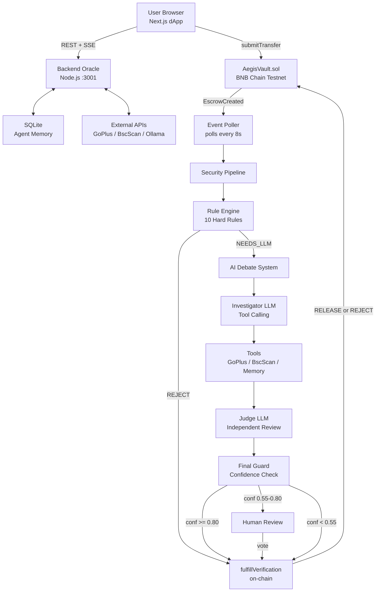
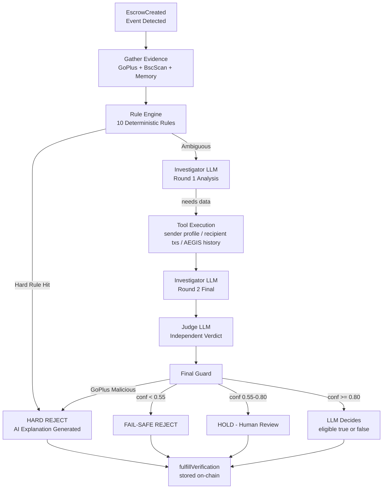
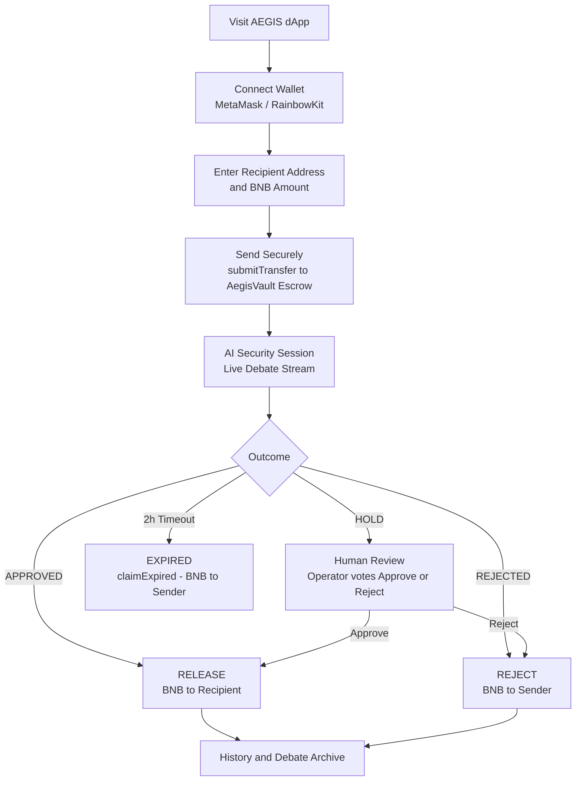

<div align="center">

# AEGIS - Autonomous Escrow Guardian & Intelligence System
### AI-Powered Smart Escrow & Security Guardian for Web3

**Autonomous AI Agent for On-Chain Transaction Security on BNB Chain**

[](https://testnet.bscscan.com/)
[](https://soliditylang.org/)
[](https://nextjs.org/)
[](https://www.typescriptlang.org/)
[](https://ollama.com/)
[](LICENSE)

> **AEGIS** is an autonomous AI oracle that guards every crypto transfer before it hits the blockchain.
> Funds are locked in a smart escrow vault, analyzed by a multi-layer AI security pipeline,
> and only released when the transaction passes - protecting users from scams, phishing, and fraud in real time.

[Architecture](#system-architecture) | [Quick Start](#quick-start) | [Smart Contract](#smart-contract) | [AI Agent Flow](#ai-agent-flow) | [Roadmap](#roadmap--business-model)

</div>

---

## Table of Contents

- [Overview](#overview)
- [Key Features](#key-features)
- [System Architecture](#system-architecture)
- [Project Structure](#project-structure)
- [Tech Stack](#tech-stack)
- [Smart Contract](#smart-contract)
- [AI Agent Flow](#ai-agent-flow)
- [User Flow](#user-flow)
- [Security Pipeline Rules](#security-pipeline-rules)
- [Quick Start](#quick-start)
- [API Reference](#api-reference)
- [Roadmap & Business Model](#roadmap--business-model)
- [Team](#team)
- [Security Disclosures](#security-disclosures)
- [License](#license)

---

## Overview

**AEGIS** (Autonomous Escrow Guardian & Intelligence System) is a **Web3 AI agent** designed to prevent
fraudulent crypto transactions before they are irreversibly settled on the blockchain.

The core premise: **most crypto scams succeed because transactions are instant and irreversible.**
AEGIS interrupts this pattern by placing every transfer into a time-locked smart escrow and running it
through a multi-layer AI security pipeline before funds are released.

### The Problem

| Problem | Impact |
|---|---|
| Crypto scams and phishing drain billions annually | $14B+ lost in 2021, growing year-over-year |
| Transactions are irreversible once confirmed | No recourse for victims after the fact |
| Users lack tools to verify recipient safety in real time | Transfers sent to wrong or malicious addresses |
| Rule-based security systems miss novel attack patterns | Zero-day exploits bypass static filters |

### The AEGIS Solution

AEGIS intercepts every transfer at the escrow level, then deploys a **three-tier AI analysis pipeline**:

1. **Rule Engine** - Deterministic hard-coded security rules (instant REJECT for known-bad patterns)
2. **AI Debate System** - A local LLM in Investigator and Judge roles debates the risk with tool-calling
3. **Human-in-the-Loop** - Edge cases escalate to a human operator before on-chain settlement

---

## Key Features

| Feature | Description |
|---|---|
| Smart Escrow Vault | Funds locked in AegisVault.sol - never accessible to the oracle owner |
| Autonomous AI Agent | Local LLM (Qwen3:8b via Ollama) analyzes every transfer automatically |
| AI Debate System | Two-round Investigator to Judge pipeline with structured JSON reasoning |
| Tool-Calling Agent | LLM requests 4 on-chain/off-chain tools to gather evidence before deciding |
| Agent Memory | SQLite-backed memory - AI remembers every past decision per address |
| GoPlus Integration | Real-time malicious address detection via GoPlus Security Intelligence |
| BscScan Intelligence | On-chain wallet age, tx history, balance, and contract detection |
| Human-in-the-Loop | Uncertain cases sent to human operator who casts the final on-chain vote |
| Live SSE Stream | Real-time AI debate streamed to the frontend via Server-Sent Events |
| Escrow Timeout | Funds auto-return to sender after 2 hours if oracle is unresponsive |
| Emergency Withdraw | Sender reclaims funds immediately if contract is paused |
| Two-Step Oracle Rotation | 24h timelock before oracle key rotation - prevents silent SPOF takeovers |
| Red Team Suite | Automated adversarial testing suite (redTeam.ts) for pipeline hardening |

---

## System Architecture


---

## Project Structure

```
AEGIS/
|-- README.md
|-- .gitignore
|
|-- contracts/                        Solidity Smart Contracts (Foundry)
|   |-- src/
|   |   +-- AegisVault.sol            Main escrow + oracle contract
|   |-- test/
|   |   +-- AegisVault.t.sol          Foundry test suite
|   |-- script/
|   |   +-- Deploy.s.sol              Deployment script (Forge broadcast)
|   |-- lib/
|   |   |-- forge-std/                Foundry standard library
|   |   +-- openzeppelin-contracts/   OpenZeppelin v5
|   |-- foundry.toml
|   +-- .env                          PRIVATE_KEY and ORACLE_ADDRESS
|
|-- backend/                          AI Oracle Backend (Node.js / TypeScript)
|   |-- index.ts                      Entry point - starts poller + HTTP server
|   |-- redTeam.ts                    Adversarial red-team test runner
|   |-- src/
|   |   |-- config.ts                 All env vars + viem public/wallet clients
|   |   |-- server.ts                 Express REST + SSE server (:3001)
|   |   |-- poller.ts                 On-chain event listener + fulfillment loop
|   |   |-- securityPipeline.ts       Main 9-step orchestration pipeline
|   |   |-- ruleEngine.ts             10 deterministic security rules
|   |   |-- aiAnalyzer.ts             LLM Investigator + Judge + tool calling
|   |   |-- tools.ts                  4 AI tools (on-chain + AEGIS DB queries)
|   |   |-- agentMemory.ts            SQLite-based per-address decision memory
|   |   |-- goplusChecker.ts          GoPlus Security API integration
|   |   |-- bscscanChecker.ts         BscScan on-chain wallet intelligence
|   |   |-- db.ts                     SQLite schema + query helpers
|   |   |-- streamBus.ts              SSE event bus (publish/subscribe pattern)
|   |   |-- abi.ts                    AegisVault ABI for viem
|   |   +-- redTeam.ts                Red-team adversarial test cases
|   |-- aegis.db                      SQLite database (auto-created on first start)
|   |-- package.json
|   |-- tsconfig.json
|   +-- .env.example
|
+-- frontend/                         Next.js Frontend (React / TypeScript)
    |-- app/
    |   |-- layout.tsx                Root layout + RainbowKit/Wagmi providers
    |   |-- page.tsx                  Main single-page dashboard
    |   +-- globals.css               Global styles + design tokens
    |-- components/
    |   |-- Hero.tsx                  Landing hero section (pre-connect state)
    |   |-- SendForm.tsx              Transfer form (wallet to escrow)
    |   |-- LiveDebate.tsx            Real-time AI debate viewer component
    |   |-- DebateStream.tsx          SSE stream context provider
    |   |-- DebateModal.tsx           Full-screen debate modal popup
    |   |-- DebateHistory.tsx         Past AI verification archive
    |   |-- EscrowHistory.tsx         Transaction history table
    |   |-- HumanReview.tsx           Human-in-the-loop review panel
    |   |-- HumanQueue.tsx            Pending human review queue provider
    |   |-- AddressFilter.tsx         Address filter input component
    |   +-- Providers.tsx             Wagmi + RainbowKit + TanStack Query providers
    |-- config/
    |   |-- contract.ts               Contract address + trimmed UI ABI
    |   +-- wagmi.ts                  Wagmi/RainbowKit chain configuration
    |-- lib/
    |   |-- api.ts                    Backend API client + typed error helpers
    |   +-- utils.ts                  Address validation and utilities
    |-- public/
    |   +-- background.jpg
    |-- next.config.ts
    |-- package.json
    |-- tsconfig.json
    +-- .env.example
```

---

## Tech Stack

### Smart Contract Layer

| Technology | Version | Purpose |
|---|---|---|
| Solidity | ^0.8.20 | Smart contract language |
| Foundry | Latest | Contract build, test, and deploy framework |
| OpenZeppelin | v5 | ReentrancyGuard security primitives |
| forge-std | Latest | Foundry testing utilities and cheatcodes |

### Backend - AI Oracle

| Technology | Version | Purpose |
|---|---|---|
| Node.js | 20+ | Runtime environment |
| TypeScript | ^7.0 | Type-safe backend development |
| tsx | ^4.23 | TypeScript execution without separate compile step |
| Express | ^5.2 | REST API and Server-Sent Events server |
| viem | ^2.56 | Type-safe Ethereum/BNB Chain client |
| better-sqlite3 | ^13.0 | Agent memory and decision history store |
| Ollama | Local | Local LLM inference runtime |
| Qwen3:8b | via Ollama | Primary AI model for Investigator and Judge roles |
| GoPlus API | v1 | Real-time malicious address and phishing detection |
| BscScan API | Testnet v1 | On-chain wallet intelligence: tx count, age, balance |

### Frontend

| Technology | Version | Purpose |
|---|---|---|
| Next.js | 16.3.5 | React framework with App Router and server-side rendering |
| React | 19.2.8 | UI component library |
| TypeScript | ^5 | End-to-end type safety |
| Wagmi | ^2.14 | Web3 React hooks for contract interaction |
| RainbowKit | ^2.0.8 | Wallet connection UI with multi-wallet support |
| viem | ^2.56 | Type-safe EVM client shared with backend |
| TanStack Query | ^5.103 | Data fetching, caching, and background polling |
| Tailwind CSS | ^4 | Utility-first styling framework |

---

## Smart Contract

### AegisVault.sol

| Property | Value |
|---|---|
| Network | BNB Smart Chain Testnet (Chain ID: 97) |
| Contract Address | 0xaCFCd2005578Aa407aFC3be7553Cad81baf58f10 |
| BscScan Explorer | https://testnet.bscscan.com/address/0xaCFCd2005578Aa407aFC3be7553Cad81baf58f10 |
| Solidity Compiler | ^0.8.20 |
| Build Framework | Foundry |
| Security Library | OpenZeppelin ReentrancyGuard |

### Core Contract Parameters

| Parameter | Value | Description |
|---|---|---|
| ESCROW_TIMEOUT | 2 hours | Auto-return funds to sender if oracle does not respond |
| ORACLE_CHANGE_DELAY | 24 hours | Timelock before oracle rotation takes effect |
| MAX_REASON_BYTES | 1024 bytes | Maximum on-chain reason string (prevents gas griefing) |

### Escrow Status Lifecycle

```
submitTransfer(recipient)
      |
      v
  Status: PENDING  ---- funds locked in AegisVault contract --------+
      |                                                              |
      +-- oracle: fulfillVerification(true)  --> COMPLETED          |
      |                                          funds to recipient |
      |                                                              |
      +-- oracle: fulfillVerification(false) --> REVERTED           |
      |                                          funds to sender    |
      |                                                              |
      +-- timeout: claimExpired()             --> EXPIRED           |
      |                                          funds to sender    |
      |                                                              |
      +-- paused: emergencyWithdraw()         --> CANCELLED         |
                                                 funds to sender
```

### Key Contract Functions

| Function | Access Control | Description |
|---|---|---|
| submitTransfer(address recipient) | public payable | Lock BNB in escrow; emits EscrowCreated |
| fulfillVerification(bytes32, bool, string) | onlyOracle | Release or revert escrow with AI reason |
| claimExpired(bytes32 escrowId) | public (permissionless) | Claim timed-out escrow; funds to sender |
| emergencyWithdraw(bytes32 escrowId) | Sender only when paused | Emergency fund recovery |
| pause() and unpause() | onlyOwner | Emergency pause for oracle maintenance |
| proposeOracle(address) | onlyOwner | Initiate oracle rotation with 24h delay |
| acceptOracle() | Pending oracle only | Finalize rotation after timelock |
| getPendingEscrows() | view | Array of all pending escrow IDs |
| getEscrowData(bytes32) | view | Sender, recipient, amount, status, createdAt |
| getEscrowStatus(bytes32) | view | Current status enum and reason string |
| isExpired(bytes32) | view | True if PENDING and ESCROW_TIMEOUT elapsed |

### Security Properties

- ReentrancyGuard on all state-changing external functions
- Owner can never take user funds - emergencyWithdraw always returns to original sender
- Two-step oracle rotation - new oracle must call acceptOracle() themselves
- 24-hour timelock on rotation - prevents silent single-point-of-failure takeover
- Permissionless claimExpired() - no stuck funds, system liveness preserved by anyone
- MAX_REASON_BYTES enforced in fulfillVerification - prevents gas griefing attacks

---

## AI Agent Flow


### AI Tool Catalog

| Tool Name | Data Source | Description |
|---|---|---|
| get_sender_profile | GoPlus + BscScan + RPC node | Full security and on-chain wallet profile of sender |
| get_recipient_recent_txs | BscScan Testnet API | Last 10 on-chain transactions of recipient |
| get_sender_db_history | SQLite AEGIS DB | Complete AEGIS escrow history for this sender |
| get_recipient_db_history | SQLite AEGIS DB | All escrows ever addressed to recipient (all senders) |

Tool execution is parallel and failure-isolated. Unavailable tools report UNKNOWN - never safe.

---

## User Flow


---

## Security Pipeline Rules

The deterministic rule engine runs **before any LLM call**, providing instant hard-reject decisions.
The rule engine can REJECT or escalate to NEEDS_LLM, but **never auto-APPROVE**.
Only the LLM with confidence >= threshold can produce an APPROVE decision.

| Rule ID | Trigger Condition | Decision |
|---|---|---|
| RULE_1A | GoPlus flags address as malicious with specific risk flags | HARD REJECT |
| RULE_1B | GoPlus flags address as malicious with no specific flags listed | HARD REJECT |
| RULE_8 | GoPlus detects phishing, honeypot, stealing, or fake-token activity | HARD REJECT |
| RULE_6 | Recipient is a smart contract address, not an EOA wallet | HARD REJECT |
| RULE_7 | Recipient balance = 0 BNB AND transfer amount >= SIGNIFICANT threshold | HARD REJECT |
| RULE_2 | New wallet + low tx count + significant amount (all three required) | HARD REJECT |
| RULE_3 | New wallet + low tx count + amount below SIGNIFICANT threshold | NEEDS_LLM |
| RULE_4 | GoPlus API unavailable - security status unconfirmable | NEEDS_LLM |
| RULE_5 | BscScan API completely unavailable - on-chain data unverifiable | NEEDS_LLM |
| RULE_9 | Transfer amount >= VERY_LARGE threshold (default 1 BNB) to any wallet | NEEDS_LLM |
| RULE_10 | Medium-age wallet + low activity + significant amount | NEEDS_LLM |
| RULE_DEFAULT | No deterministic rejection signal found | NEEDS_LLM |

Default configurable thresholds:

| Environment Variable | Default | Meaning |
|---|---|---|
| NEW_WALLET_DAYS | 1 day | Age below this = new wallet classification |
| LOW_TX_COUNT_THRESHOLD | 2 | Tx count at or below this = low activity |
| SIGNIFICANT_TRANSFER_BNB | 0.01 BNB | Amount at or above this = significant transfer |
| VERY_LARGE_TRANSFER_BNB | 1.0 BNB | Amount at or above this = escalate regardless |
| MEDIUM_WALLET_DAYS | 30 days | Upper bound of medium-age wallet category |
| MEDIUM_TX_THRESHOLD | 10 | Max tx count for medium wallet low-activity |

---

## Quick Start

### Prerequisites

| Requirement | Version | Notes |
|---|---|---|
| Node.js | 20+ | https://nodejs.org |
| Foundry | Latest | curl -L https://foundry.paradigm.xyz pipe bash |
| Ollama | Latest | https://ollama.com |
| Git | Any | |
| MetaMask | Any | Browser extension, BSC Testnet network |

### Step 1 - Clone the Repository

```bash
git clone https://github.com/hzBoydev/AEGIS.git
cd AEGIS
```

### Step 2 - Set Up Ollama (Local LLM)

```bash
# Install Ollama (Linux/macOS)
curl -fsSL https://ollama.com/install.sh | sh

# Pull the Qwen3 8B model (approx 5 GB download)
ollama pull qwen3:8b

# Start the Ollama server (must be running before the backend)
ollama serve
```

**Demo tip:** Run `ollama serve` and make one warm-up inference request before your presentation
to avoid the cold-start latency during the live demo.

### Step 3 - Smart Contract Setup (Skip - Already Deployed)

The AegisVault contract is already live at `0xaCFCd2005578Aa407aFC3be7553Cad81baf58f10` on BSC Testnet.
Follow this step only if you want to deploy your own instance.

```bash
cd contracts
forge install

cp .env.example .env
# Edit .env: fill PRIVATE_KEY and ORACLE_ADDRESS

forge test -vvv

forge script script/Deploy.s.sol \
  --rpc-url https://bsc-testnet-rpc.publicnode.com \
  --broadcast \
  --verify
```

### Step 4 - Backend Setup

```bash
cd backend
npm install
cp .env.example .env
```


```bash
npm run dev
# Backend oracle starts on http://localhost:3001
# Begins polling BNB Chain Testnet every 8 seconds
```

### Step 5 - Frontend Setup

```bash
cd frontend
npm install
cp .env.example .env.local
```


```bash
npm run dev
# Frontend starts on http://localhost:3000
```

### Step 6 - Configure MetaMask for BSC Testnet

| Setting | Value |
|---|---|
| Network Name | BNB Smart Chain Testnet |
| New RPC URL | https://bsc-testnet-rpc.publicnode.com |
| Chain ID | 97 |
| Currency Symbol | tBNB |
| Block Explorer URL | https://testnet.bscscan.com |

Get free testnet BNB: https://www.bnbchain.org/en/testnet-faucet

---


---

## API Reference

### REST Endpoints

| Method | Endpoint | Query Parameters | Description |
|---|---|---|---|
| GET | /api/escrows | limit (max 200), address | All AEGIS decision history with pagination |
| GET | /api/debates | limit (max 100), address | All AI debate session archives |
| GET | /api/human/pending | none | Escrows currently awaiting human operator review |
| POST | /api/human/vote | body: { escrowId, approve: boolean } | Submit human operator vote |

### Server-Sent Events Stream

Connect to `/api/stream` to receive real-time AI debate events.

Each event message is a JSON object with the following structure:

```
{
  escrowId   : string    - 0x-prefixed bytes32 escrow identifier
  phase      : string    - gather | rule | investigate | judge | human | final
  status     : string    - start | done | error
  label      : string    - human-readable phase label for the UI
  detail     : string    - full AI reasoning, explanation, or error message
  data       : {
    eligible         : boolean  - AI eligibility decision (true = release)
    confidence       : number   - 0.0 to 1.0 confidence score
    riskLevel        : string   - LOW | MEDIUM | HIGH | CRITICAL
    decidedBy        : string   - hard_rule | fail_safe | llm | human_review
    needsHuman       : boolean  - true when escalated to human operator
    aiRecommendation : boolean  - AI suggestion shown to human reviewer
  }
}
```

---

## Roadmap & Business Model

### Phase 1 - Hackathon MVP [Current - September 2026]

- [x] AegisVault smart contract with escrow and oracle pattern
- [x] 9-step AI security pipeline: Rule Engine, Investigator LLM, Judge LLM
- [x] Tool-calling agent with 4 data gathering tools
- [x] Agent memory via SQLite with complete per-address decision history
- [x] GoPlus Security and BscScan external API integration
- [x] Human-in-the-loop escalation with full frontend UI
- [x] Live SSE debate stream with real-time frontend phase updates
- [x] Emergency pause and two-step oracle rotation with 24-hour timelock
- [x] Automated red team adversarial test suite
- [x] Deployed and live on BNB Chain Testnet

---

### Phase 2 - Production Hardening [Q1 2027]

- [ ] Multi-chain deployment: Ethereum Mainnet, Polygon, Arbitrum, Base, BSC Mainnet
- [ ] Decentralized oracle network: multi-sig committee with 5+ nodes replaces single oracle
- [ ] LLM upgrade: migrate from Qwen3:8b to GPT-4o or Claude 3.5 Sonnet
- [ ] Formal smart contract audit by CertiK, Hacken, or Trail of Bits
- [ ] On-chain reputation scores published as ERC-compatible oracle data feeds
- [ ] ML-enhanced rule engine: generate new rules from historical decision patterns
- [ ] AEGIS npm SDK: any dApp integrates AEGIS protection in under 10 lines of code

---

### Phase 3 - Ecosystem Expansion [Q2 to Q3 2027]

- [ ] AEGIS Governance Token (AGS): staking for oracle node operators and DAO voting
- [ ] Oracle DAO: decentralized governance of rule engine thresholds and parameters
- [ ] Plugin marketplace: CEX withdrawal checker, social graph analysis, NFT scam detector
- [ ] AEGIS B2B API: REST API for exchanges, wallets, custodians, and DeFi protocols
- [ ] Browser extension: pre-transaction security warning overlay on any Web3 dApp
- [ ] Mobile SDK: iOS and Android SDK for crypto wallet developers

---

### Phase 4 - Market Expansion [Q4 2027 onward]

- [ ] Enterprise white-label: AEGIS oracle under client brand for institutional custodians
- [ ] AML and KYC compliance module: regulatory-compatible address screening layer
- [ ] DeFi insurance integration: partner with Nexus Mutual or Sherlock for AEGIS-verified coverage
- [ ] Cross-chain bridge protection: verify bridge transactions before cross-chain fund release

---

## Business Model

### Four Revenue Tiers

```
Tier 1: PROTOCOL FEE (On-Chain, Permissionless)
   Basis-point fee on every RELEASED escrow (e.g. 0.1% of transfer value)
   No fee on rejections or fund returns - fully aligned with user interests
   Fee collected atomically in AegisVault smart contract at fulfillment
   Addressable market: $50B+ monthly crypto transfer volume globally

Tier 2: SAAS API (B2B - Exchanges, Wallets, DeFi Protocols)
   REST API for address risk screening and transfer risk scoring
     Starter    :   1,000 address checks per month ->   $99 USD per month
     Growth     :  50,000 address checks per month ->  $999 USD per month
     Enterprise :  Unlimited                        ->  Custom pricing

Tier 3: WHITE-LABEL ORACLE (Enterprise Licensing)
   Deploy AEGIS oracle infrastructure under client brand name
   Custom rule engine thresholds configured per institution
   Dedicated cloud infrastructure with contractual uptime SLA
   Annual contract range: $50,000 to $500,000 USD per year

Tier 4: TOKEN ECONOMY (AGS Governance Token)
   Stake AGS to operate a verified oracle node and earn protocol fee share
   Hold AGS to participate in DAO governance of rule engine parameters
   Burn AGS for loyalty discount on personal protocol fee rate
```

---

### VC and Fundraising Strategy

#### Seed Round Target: $1.5M to $2.5M USD

| Parameter | Detail |
|---|---|
| Round Stage | Pre-Seed / Seed |
| Capital Target | $1.5M to $2.5M USD |
| Equity Offered | 10% to 15% |
| Token Allocation | 5% of AGS total supply to seed investors (2-year vesting, 6-month cliff) |
| Use of Funds | Engineering 40% / Audit 20% / BD and Growth 25% / Operations 15% |
| Target Close | Q2 2027 |

#### Target Investor Profiles

| Category | Target Firms and Programs |
|---|---|
| Web3 Crypto Venture Capital | Multicoin Capital, Paradigm, a16z Crypto, Pantera Capital |
| Exchange Ecosystem VCs | Binance Labs, OKX Ventures, Coinbase Ventures |
| Blockchain Security Investors | CertiK Ventures, Forta Network ecosystem funds |
| Strategic Angels | Security researchers, former CEX founders, wallet product founders |
| Ecosystem Grant Programs | BNB Chain Grants, Chainlink BUILD, Ethereum Foundation ESP |

#### Pitch Narrative for Investors

Over $10 billion USD is lost to crypto scams every year. AEGIS is the first autonomous AI guardian
that stops fraudulent transactions before they happen - not after. We have shipped a working product
deployed on-chain with a novel AI debate architecture that has no direct precedent in Web3 security.
Every transfer enters an escrow vault, passes through a 10-rule deterministic engine, and is evaluated
by a two-round LLM debate before a single token moves. The oracle cryptographically cannot take user
funds. The system fails safe by design. Human operators hold override authority.

#### Key Performance Metrics for Investor Due Diligence

| Metric | Current State MVP | Target 6 Months Post-Raise |
|---|---|---|
| Transactions protected | Testnet demo transactions | 10,000+ mainnet verified transfers |
| False positive rate | Less than 5% | Less than 1% |
| AI decision latency | Approximately 30 seconds | Under 10 seconds |
| Supported blockchains | BSC Testnet | BSC + Ethereum + Polygon + Arbitrum |
| B2B API customers | 0 | 3 signed Letters of Intent |
| Monthly recurring revenue | $0 | $50,000 USD MRR |
| Oracle decentralization | Single node | Multi-sig committee with 5 nodes |

#### Grant and Acceleration Programs

| Program | Estimated Funding | Recommended Action |
|---|---|---|
| BNB Chain Innovation Program | Up to $100,000 USD | Apply immediately after hackathon result |
| Binance Labs MVBP Accelerator | $50,000 + acceleration support | Apply with hackathon placement proof |
| Chainlink BUILD Program | Developer support + co-marketing | Apply for oracle integration partnership |
| Ethereum Foundation Ecosystem Support | $10,000 to $100,000 USD | Apply with security research angle |
| Decentralized Security Alliance | Varies by project | Apply |
| Polygon Village Grant | Up to $50,000 USD | Apply during Phase 2 multi-chain expansion |

---

## Running Tests

### Smart Contract Tests (Foundry)

```bash
cd contracts
forge test -vvv
```

### Backend Red Team Tests

```bash
cd backend
npm run redteam
```

The red team suite validates:

- Prompt injection resistance (malicious recipient trying to influence the AI reasoning)
- Confidence threshold bypass attempts via adversarial prompt crafting
- JSON parsing edge cases from malformed or truncated LLM output
- Tool-calling hallucination detection (invalid tool names rejected at the catalog)
- Fail-safe behavior on LLM timeout, error, or low-confidence output

### Type Checking

```bash
# Backend TypeScript type check
cd backend && npm run typecheck

# Frontend: build process validates all TypeScript types
cd frontend && npm run build
```

---

## Repository

| Resource | URL |
|---|---|
| GitHub Repository | https://github.com/hzBoydev/AEGIS |
| Smart Contract on BscScan | https://testnet.bscscan.com/address/0xaCFCd2005578Aa407aFC3be7553Cad81baf58f10 |
| BNB Chain Testnet Faucet | https://www.bnbchain.org/en/testnet-faucet |
| Ollama Local LLM Runtime | https://ollama.com |
| GoPlus Security API Docs | https://gopluslabs.io |

---

## Team

| Role | Responsibilities |
|---|---|
| Full-Stack Engineer and Researcher | Smart contract design, AI oracle backend, 9-step security pipeline, Next.js frontend, red team testing |

---

## Security Disclosures

- Project deployed on BNB Chain Testnet only - do not use with real mainnet funds at this stage
- AI oracle is currently a centralized single node - decentralization targeted in Phase 2
- GOPLUS_SIMULATE=true is active in demo mode - must be set to false before any mainnet deployment
- Oracle private key must be stored in an HSM or hardware wallet (e.g. Ledger) in production
- Smart contract has not yet been formally audited by an independent third-party security firm

---

## License

Licensed under the **ISC License**.

---

Built for the Web3 Hackathon 2026.

Protecting every transfer, one escrow at a time.

**AEGIS** - Autonomous Escrow Guardian and Intelligence System
